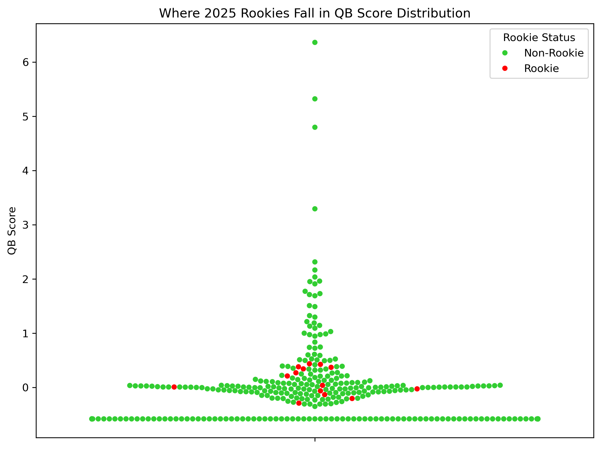
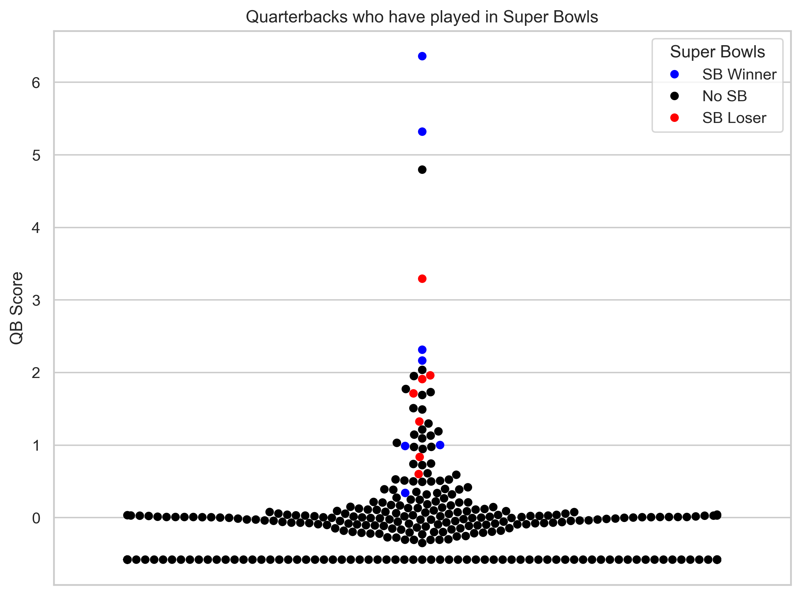
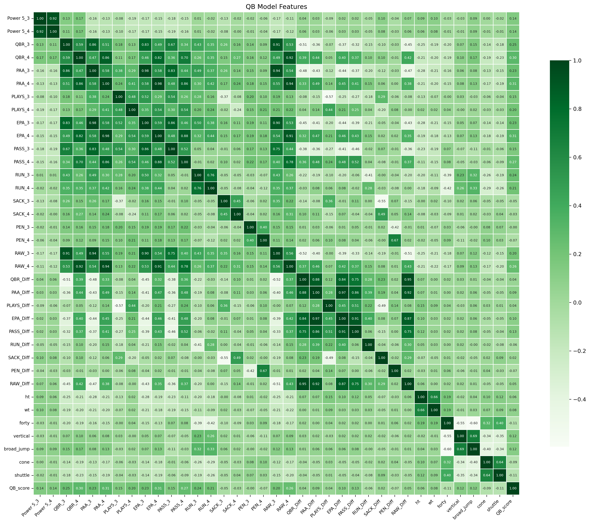

# NFL_Quarterback_Model

## An overall look at the 2025 rookie QB class

Before we get into the comps, let's get a general sense of the overall strength of the 2025 NFL rookie quarterback class. This swarmplot falls in line with the general consensus that this is not a great quarterback class. The green dots represent every quarterback in the dataset that the model was trained on. These are quarterbacks whose careers began in 2005 or later. QB_score is our target variable. That's explained in more detail in the notebooks. The red dots represent the top 14 rookie quarterbacks, without names for now. 

With this in mind, we know that we shouldn't expect any of these rookies to be compared to any great quarterbacks who have played in the NFL. 

## Not just any QB can get a team to the Super Bowl

The blue dots represent quarterbacks in our dataset (careers beginning in 2005 or later) who have won at least one Super Bowl. The red dots represent quarterbacks who have reached at least one Super Bowl without winning one. The black dots represent the rest of the quarterbacks. 

## Feature glossary
(feature names followed by '_4' indicate last year of college. Feature names followed by '_3' indicate second-to-last year of college. Feature names followed by '_Diff' indicate the difference between the two years, indicating if there was improvement)
* Power 5: Binary indicator. Did the quarterback play in a Power 5 conference?
* QBR: (from ESPN) Adjusted Total Quarterback Rating, which values the quarterback on all play types on a 0-100 scale adjusted for the strength of opposing defenses faced.
* PAA: (from ESPN) Number of points contributed by a quarterback, accounting for QBR and how much he plays, above the level of an average quarterback.
* PLAYS: (from ESPN) Number of points contributed by a quarterback, accounting for QBR and how much he plays, above the level of an average quarterback.
* EPA: (from ESPN) Total expected points added with low leverage plays, according to ESPN Win Probability model, down-weighted.
* PASS: (from ESPN) Expected points added on pass attempts with low leverage plays down-weighted.
* RUN: (from ESPN) Clutch-weighted expected points added through rushes.
* SACK (from ESPN): Expected points added on sacks with low leverage plays down-weighted.
* PEN (from ESPN): Expected points added on penalties with low leverage plays down-weighted.
* RAW (from ESPN): Raw Total Quarterback Rating, which values quarterback on all play types on a 0-100 scale (not adjusted for opposing defenses faced).
* ht: Height (in inches)
* wt: Weight (in pounds)
* forty: 40-yard dash time at the NFL Scouting Combine (in seconds)
* vertical: Vertical leap at the NFL Scouting Combine (in inches)
* broad_jump: Broad jump at the NFL Scouting Combine (in inches)
* cone: Cone drill time at the NFL Scouting Combine (in seconds)
* shuttle: Shuttle time at the NFL Scouting Combine (in seconds)

## Correlation heatmap

## Target variable formula

0.1 * Total Win Probability Added for career +
0.3 * WPA per season +
0.2 * Total career touchdown passes + 
0.1 * TD passes per season +
0.2 * Total All-Pro selections +
0.1 * All-Pro selections per season

## Coming up
* Show model performance dataframe
* Show test set predictions dataframe (highlights and lowlights)
* Show comps
* Show dataset ranked by QB_score
